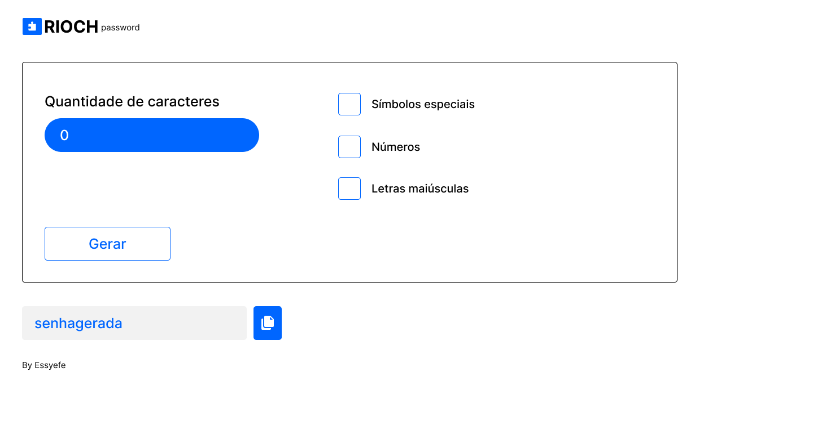

# [RIOCH password](https://essyefe.github.io/riochpassword/)

---

## Gerador de senhas

O RIOCH é um gerador de senhas complexo que cria senhas com letras maiúsculas, minúsculas, símbolos especiais e números de acordo com as preferências do usuário.

## Pré-visualização

